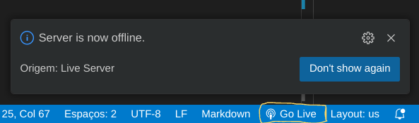

# Site Responsivo

Este é um projeto simples de um site responsivo, criado utilizando **HTML** e **Tailwind CSS**. O objetivo principal é atender aos requisitos especificados para a atividade de Frontend, incluindo responsividade, tipografia variada e personalização para obtenção de nota na matéria de prática e pesquisa do Novo Ensino Suplementar (NES).

---

## 🎯 **Objetivo**
Construir um site com pelo menos 3 páginas utilizando HTML e CSS (Tailwind), respeitando os seguintes requisitos:
- Criar 3 páginas: `index.html`, `about.html` e `contact.html`.
- Respeitar a construção semântica do layout.
- Garantir que o site seja responsivo utilizando flexbox e breakpoints do Tailwind.
- Utilizar uma diversidade de tipografias (tamanhos, espessuras e cores).
- Incluir pelo menos 2 pseudo-classes (ex.: `hover`, `focus`).
- Adicionar uma tabela personalizada.
- Utilizar uma paleta de cores padrão do Tailwind ou criar uma própria.

---

## 🚀 **Como Rodar o Projeto**
### Localmente:
1. Adicione o repositório no vscode em sua máquina através do comando 
```
git clone https://github.com/NexusSong/Frontend_nes.git
```
2. Verifique se a extensão live Server está instalada, caso esteja, clique na opção destacada que se localiza no canto inferior esquerdo, como no exemplo abaixo.


3. Com o botão direito, clique no arquivo que deseja abrir o site e clique na opção 'Open with Live Server'.
---

## 📂 **Estrutura do Projeto**
```
Frontend_nes/
├── exemplos/          # Diretório com exemplos práticos
│   ├── ex1.png        # Imagem de exemplo utilizada no projeto
├── NexusTeam/         # Diretório para arquivos do time Nexus
│   ├── index.html       # Página inicial do site
│   ├── about.html       # Página: informações gerais
│   ├── contact.html     # Página: contato
├── LICENSE            # Arquivo com a licença do projeto
├── README.md          # Documentação do projeto
```
## 🌟 Requisitos Atendidos

3 páginas diferentes: ✅

Construção semântica: ✅

Responsividade: ✅ Utilizando flexbox e breakpoints do Tailwind.

Diversidade de tipografias: ✅ Trabalhado com font-size, font-weight e text-color.

Variedade de cores: ✅ Utilização de paleta padrão do Tailwind.

Pseudo-classes: ✅ Incluídas hover e focus nos elementos de interação.

Tabela personalizada: ✅ Criada na página inicial.

## ✨ Tecnologias Utilizadas

HTML5: Estrutura do site.

CSS (Tailwind): Estilização responsiva e moderna.